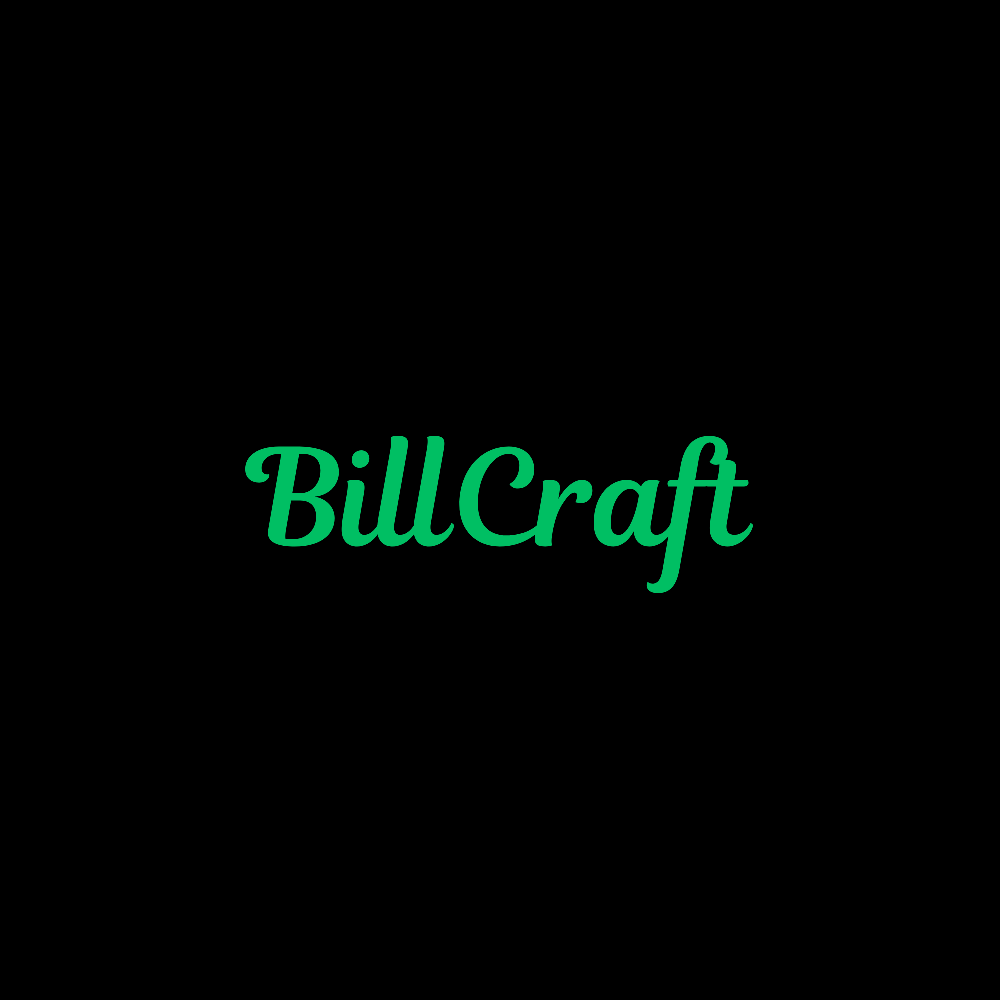

<div align="center">



# BillCraft

**Professional invoicing and contract generation platform**

[](https://react.dev/)
[](https://vitejs.dev/)
[](https://tailwindcss.com/)
[](LICENSE)

</div>

---

## Overview

BillCraft is a sleek, dark-themed web application designed for freelancers and small businesses to manage clients, generate professional invoices, and create contracts — all in one place.

---

## Features

| Feature | Description |
|---|---|
| **Invoice Generator** | Create and export professional invoices in seconds |
| **Contract Builder** | Draft and manage client contracts with a rich editor |
| **Client Management** | Store, update, and organize all your client details |
| **My Generations** | Track the history and status of all generated documents |
| **Dashboard** | Get a quick overview of your activity and stats |
| **Authentication** | Secure login and sign-up flow |

---

## Tech Stack

### Frontend
- **React 19** — UI library
- **React Router v7** — Client-side routing
- **Tailwind CSS v3** — Utility-first styling
- **Vite 7** — Lightning-fast build tool

### Backend
- Coming soon

---

## Project Structure

```
BillCraft/
├── frontend/
│   ├── public/
│   └── src/
│       ├── assets/          # Static assets (logo, images)
│       ├── components/      # Reusable UI components
│       │   └── Sidebar.jsx
│       ├── context/
│       │   └── AppContext.jsx   # Global app state
│       ├── pages/           # Route-level page components
│       │   ├── SplashScreen.jsx
│       │   ├── HomeScreen.jsx
│       │   ├── LoginScreen.jsx
│       │   ├── SignUpScreen.jsx
│       │   ├── Dashboard.jsx
│       │   ├── ClientScreen.jsx
│       │   ├── InvoiceGenerator.jsx
│       │   ├── ContractBuilder.jsx
│       │   ├── ContractGenerator.jsx
│       │   ├── MyGenerations.jsx
│       │   └── ProfileScreen.jsx
│       ├── App.jsx
│       ├── main.jsx
│       └── index.css
└── backend/                 # (In development)
```

---

## Getting Started

### Prerequisites
- [Node.js](https://nodejs.org/) v18+
- npm or yarn

### Installation

```bash
# Clone the repository
git clone https://github.com/MerLin027/BillCraft.git
cd BillCraft

# Install frontend dependencies
cd frontend
npm install

# Start the development server
npm run dev
```

The app will be available at `http://localhost:5173`.

### Available Scripts

```bash
npm run dev       # Start development server
npm run build     # Build for production
npm run preview   # Preview production build
npm run lint      # Run ESLint
```

---

## Design

BillCraft uses a minimal dark aesthetic built around:

- **Background:** `#0a0a0a` — near-black canvas
- **Accent:** `#22c55e` — vibrant green for highlights and CTAs
- **Typography:** Custom display font for a modern, professional feel

---

## License

This project is licensed under the [MIT License](LICENSE).

---

<div align="center">

Made with dedication at **CHARUSAT University**

</div>
