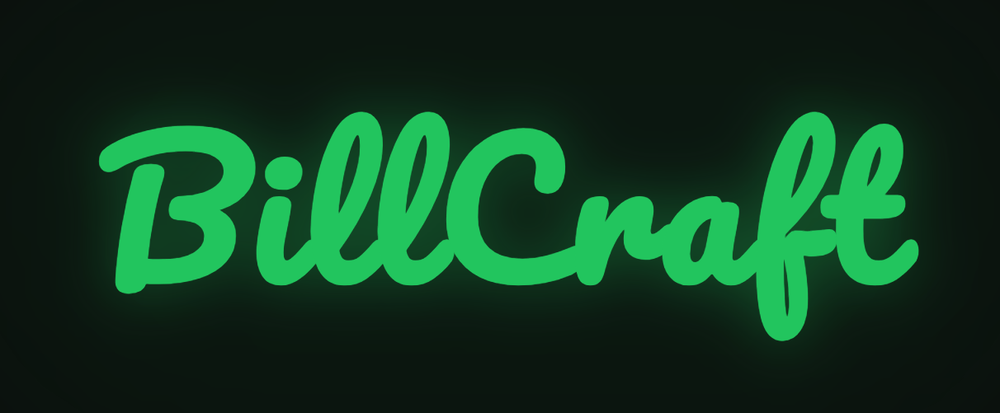

<div align="center">



**Professional invoicing and contract generation platform**

[](https://react.dev/)
[](https://vitejs.dev/)
[](https://tailwindcss.com/)
[](https://nodejs.org/)
[](https://expressjs.com/)
[](LICENSE)

</div>

---

## Overview

BillCraft is a sleek, dark-themed web application designed for freelancers and small businesses to manage clients, generate professional invoices, and create contracts — all in one place.

Invoices and contracts can be downloaded as **styled PDF** or **Word (.docx)** files directly to your local machine.

---

## Features

| Feature | Description |
|---|---|
| **Invoice Generator** | Build invoices with line items, tax, and notes — download as PDF or Word |
| **Contract Builder** | Draft contracts with payment terms, clauses, and signature blocks — download as PDF or Word |
| **Client Management** | Store, update, and organize all your client details |
| **My Generations** | Track the history and status of all generated documents |
| **Dashboard** | Quick overview of activity and pending payments |
| **Authentication** | Login and sign-up flow (mock auth — real auth coming soon) |

---

## Tech Stack

### Frontend
- **React 19** — UI library
- **React Router v7** — Client-side routing
- **Tailwind CSS v3** — Utility-first styling
- **Vite 7** — Build tool

### Backend
- **Node.js 18+** — Runtime
- **Express 5** — REST API
- **PDFKit** — Server-side PDF generation
- **docx** — Server-side Word document generation

---

## Project Structure

```
BillCraft/
├── frontend/
│   └── src/
│       ├── assets/          # Logo, images
│       ├── components/
│       │   └── Sidebar.jsx
│       ├── context/
│       │   └── AppContext.jsx
│       ├── data/
│       │   └── staticClients.js
│       └── pages/
│           ├── SplashScreen.jsx
│           ├── HomeScreen.jsx
│           ├── LoginScreen.jsx
│           ├── SignUpScreen.jsx
│           ├── Dashboard.jsx
│           ├── ClientScreen.jsx
│           ├── InvoiceGenerator.jsx      ← PDF + Word download
│           ├── ContractBuilderEditor.jsx ← PDF + Word download
│           ├── ContractGenerator.jsx
│           ├── MyGenerations.jsx
│           └── ProfileScreen.jsx
│
└── backend/
    ├── src/
    │   ├── server.js              # Entry point — port 4000
    │   └── routes/
    │       ├── invoices.js        # POST /api/invoices/download  → PDF
    │       ├── invoiceWord.js     # POST /api/invoices/word      → .docx
    │       ├── contracts.js       # POST /api/contracts/download → PDF
    │       └── contractWord.js    # POST /api/contracts/word     → .docx
    └── package.json
```

---

## Getting Started

### Prerequisites
- [Node.js](https://nodejs.org/) v18+

### Installation

```bash
# 1 — Install frontend dependencies
cd frontend
npm install

# 2 — Install backend dependencies
cd ../backend
npm install
```

### Running the App

Open **two terminals**:

```bash
# Terminal 1 — Backend API (port 4000)
cd backend
npm start

# Terminal 2 — Frontend dev server (port 5173)
cd frontend
npm run dev
```

Open **http://localhost:5173** in your browser.

> The backend must be running for PDF and Word downloads to work.

---

## API Reference

All endpoints accept `Content-Type: application/json` via POST and return a file download.

### `POST /api/invoices/download` — Invoice PDF

### `POST /api/invoices/word` — Invoice Word (.docx)

Both accept the same body:

| Field | Type | Example |
|---|---|---|
| `invoiceNumber` | string | `"INV-0024"` |
| `dateIssued` | string | `"2025-05-01"` |
| `dateDue` | string | `"2025-05-31"` |
| `fromName` | string | `"Jane Doe Designs"` |
| `fromEmail / fromStreet / fromCity / fromZip` | string | address fields |
| `toName / toEmail / toCompany / toPhone / toStreet / toCity / toZip` | string | client fields |
| `items` | array | `[{ desc, rate, qty }]` |
| `taxRate` | number | `18` |
| `notes` | string | `"Thank you!"` |

---

### `POST /api/contracts/download` — Contract PDF

### `POST /api/contracts/word` — Contract Word (.docx)

Both accept the same body:

| Field | Type | Example |
|---|---|---|
| `contractTitle` | string | `"Freelance Service Agreement"` |
| `freelancerName / freelancerEmail / effectiveDate` | string | |
| `clientName / businessName / clientPhone / businessType` | string | |
| `items` | array | `[{ desc, rate, qty }]` scope of work |
| `deposit` | number | `50` (percentage) |
| `dueDate` | string | `"Net 30"` |
| `milestones / lateFee / ipTransfer / portfolio` | boolean | contract clauses |

---

## Design System

| Token | Value |
|---|---|
| Background | `#0a0a0a` |
| Card / Surface | `#1a1a1a` |
| Sidebar | `#111111` |
| Border | `#2a2a2a` |
| Accent Green | `#22c55e` |
| Text Primary | `#f5f5f5` |
| Text Secondary | `#888888` |
| Danger | `#ef4444` |
| Warning / Pending | `#f59e0b` |

---

## Roadmap

- [x] Frontend — all 9 screens
- [x] PDF download — invoices & contracts
- [x] Word (.docx) download — invoices & contracts
- [ ] Real authentication — JWT + bcrypt
- [ ] Database — PostgreSQL for persistent data
- [ ] Profile save — update AppContext + localStorage

---

## License

This project is licensed under the [MIT License](LICENSE).
